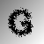

### Слои нейроннных сетей
* Свёрточный - это основной блок свёрточной нейронной сети. Слой свёртки включает в себя для каждого канала свой фильтр, ядро свёртки которого обрабатывает предыдущий слой по фрагментам (суммируя результаты матричного произведения для каждого фрагмента). Весовые коэффициенты ядра свёртки (небольшой матрицы) неизвестны и устанавливаются в процессе обучения. Особенностью свёрточного слоя является сравнительно небольшое количество параметров, устанавливаемое при обучении.
* Пулинг - представляет собой нелинейное уплотнение карты признаков, при этом группа пикселей (обычно размера 2×2) уплотняется до одного пикселя, проходя нелинейное преобразование. Наиболее употребительна при этом функция максимума. Преобразования затрагивают непересекающиеся прямоугольники или квадраты, каждый из которых ужимается в один пиксель, при этом выбирается пиксель, имеющий максимальное значение.
* Полносвязный - берёт вводные данные и выводит N-пространственный вектор, где N — число классов, из которых программа выбирает нужный.
* Слайс - это служебный слой, который разрезает входной слой на несколько выходных слоёв по заданному способу.
* ReLU - функция активации y = max(0, x) после свёрточного слоя, однако для активации выбирается вместо обычных функций типа гиперболического тангенса или сигмоиды ненасыщаемая функция. Такая функция показывает хорошие результаты при обучении нейронных сетей и отвечает за отсечение ненужных деталей в канале.
* Dropout -  dropout с параметром p за одну итерацию обучения проходит по всем нейронам определенного слоя и с вероятностью p полностью исключает их из сети на время итерации. Это заставит сеть обрабатывать ошибки и не полагаться на существование определенного нейрона (или группы нейронов), а полагаться на “единое мнение” (consensus) нейронов внутри одного слоя.

### Рассмотренные архитектуры нейроных сетей
* LeNet - свёрточная нейронная сеть, которую разработал Ян ЛеКун для распознования рукописного и печатного текста.
* VGG-16 - свёрточная нейронная сеть, разраотанная в Оксфорде Visual Geometry Group. Сеть состоит только из слоёв: 3x3 convolution и 2x2 pooling
* ResNet-50 (Residual Networks) - свёрточная нейронная сеть, позволяющая строить нейронные сети с большим количеством слоёв. В архитектуре используются identity layers, то есть слои, которые просто пропускают сигнал дальше без изменений. Более глубокие уровни предсказывают разницу между тем, что выдают предыдущие слои и целью. Отсюда название — Deep Residual Learning, то есть обучаемся предсказывать отклонения от прошлых слоёв. Для этого в ResNet архитектура строится по следующему принципу: два слоя с весами (могут быть convolution, могут быть нет), и shortcut connection, который identity. Результат после двух слоёв добавляется к этому identity.
* CaptchaNet - 3 свёрточных слоя, каждый со своим пулингом и 2 полносвязных.

### Побуквенный подход
Сеть обучается на одном символе. Изображение нарезается на несколько частей. Для каждой части применяется сеть и из полученной последовательности формируется ответ.
Этот подход не был успешным, т.к. получаемые части плохо распознавались сетями, т.к. имели непредусмотренный в обучении шум получаемый в результате "нарезки".

### Капча фиксированного размера
Рассмотрим более узкий класс задач - распознавание капчи фиксированного размера, а именно: шестисимвольную капчу. Сети обучаются сразу на всей капче. Для того чтобы получить шесть выходов вместо одного добавлятся в конце сети служебный слой slice, который разбивает выходы на нужное количество частей

### Обучение сетей
Для обучения каждой сети подбирались параметры и вид обучения. Использованные виды обучения:
* Стохастический градиентный спуск
* Adam (Adaptive Moment Estimation) - обобщение метода AdaGrad

[Более подробно можно узнать здесь](http://caffe.berkeleyvision.org/tutorial/solver.html)

Для каждой сети подбирались скорость обучения и стратегия её изменения. В частности были использованы следующие стратегии:
* step - скорость обучения имеет вид: base_lr * gamma ^ (floor(iter / step))
* inv - скорость обучения имеет вид: base_lr * (1 + gamma * iter) ^ (- power)

Для сетей VGG16 и Resnet-50 были использованы обученные модели с целью их дообучения, однако эти модели нельзя было использовать на полутоновых выборках из-за несовпадения размерностей сетей в этих случаях. 

## Обучающая выборка

Обучающая выборка на первых этапах состояла из картинок, содержащих один символ и градиентный фон. Размер выборок был небольшим (в пределах 3-5 тысяч изображений, около 50 примеров на один символ). В выборку были также включены избражения без искажений. Сначала по одному, в дальнейшем до половины примеров одного символа. В качестве генератора капч был выбран [SimpleCaptcha](http://simplecaptcha.sourceforge.net/)

Были использованы следующие искажения:

- Сдвиг (shear)

  
  

- Кривые

  
  
  
- "Рыбий глаз" + сетка

  
  

- Закручивание (twirl)

  
  

- Распыление (diffusion)

  
  

Следующие выборки включали в себя минимум искажений, но содержали несколько шрифтов:

Обучающая выборка для CaptchaNet состояла из картинок с текстом длины 6, с одним шрифтом, шумом в виде линии и точек и искажениями символов:

Размер выборки составлял 200000 изображений.

Добавочная к данной выборка, на которой в дальнейшем дообучалась сеть, включала в себя изображения из шести символов с одним шрифтом и искажениями diffuse и twirl:

